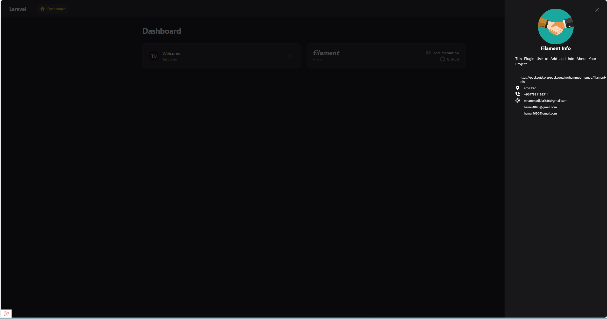

# Filament Info
This Plugin Use to Add and Info About Your Project

## Installation
```bash
composer require mohammed_hamad/filament-info 
``` 

### Configure
```bash
      ->plugins([
                   FilamentInfoPlugIn::make()
                     ->brandLogo(asset('https://freepngimg.com/download/business/70298-management-business-icons-consultant-company-social-marketing.png'))
                    ->icon( 'heroicon-o-information-circle')
                    ->modalHeading('Filament Info')
                    ->modalDescription('This Plugin Use to Add and Info About Your Project')
                    ->websiteUrl('https://packagist.org/packages/mohammed_hamad/filament-info')
                    ->phoneNumbers([
                        '+9647831193514'
                    ])->emails([
                        'mhammadjalal556@gmail.com',
                        'hamaj4095@gmail.com',
                        'hamaj4096@gmail.com'
                                ])
                    ->addresses([
                        'erbil Iraq',
                    ])
      ])
```
### ScreenShoot
